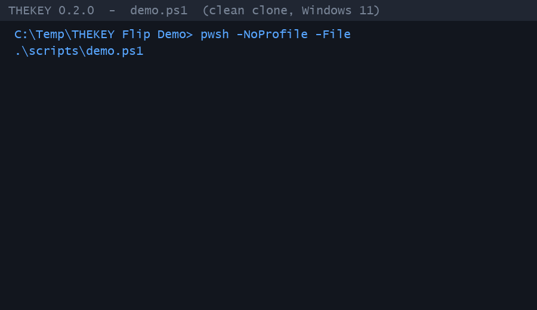

# THEKEY

## Transacciones Git gobernadas para agentes de programación.

> **THEKEY** · *Governed Git transactions for coding agents.*
> Versión completa en inglés: [README.en.md](README.en.md)

**THEKEY 0.2.0 — Public Preview.** Pequeño núcleo serio para transacciones Git
gobernadas orientadas a agentes de programación, con **aislamiento de flujo de
trabajo**, **puertas deterministas** y **evidencia auditable**.

THEKEY es un núcleo pequeño y serio para transacciones Git gobernadas destinadas
a agentes de programación. Ofrece aislamiento de flujo de trabajo, puertas
deterministas y evidencia auditable. No proporciona sandboxing a nivel de
sistema operativo.

[](.github/workflows/tests.yml)
[](LICENSE)


> English: *Governed Git transactions for coding agents · isolated workspaces,
> deterministic gates, auditable evidence.* Full version: [README.en.md](README.en.md)



Ejecuta agentes en workspaces aislados, verifica cada cambio mediante gates
deterministas y promueve únicamente resultados con evidencia auditable.
**102 tests, 0 skipped**, demo reproducible en Windows 11 sin Docker, sin WSL,
sin GPU.

---

## Qué es

THEKEY resuelve un problema concreto: los cambios de software impulsados por
agentes suelen ser una mezcla opaca de «alguien editó algo, corrieron tests,
enviamos». THEKEY hace que el cambio sea **gobernado**.

- **Para quién es:** agentes de programación, pipelines de CI y equipos que
  quieren automatizar cambios de código con trazabilidad y sin tocar la fuente
  original.
- **Qué hace realmente:** separa planificación, ejecución, verificación y
  autorización de política en roles distintos; aplica las puertas definidas por
  una política como código; y produce evidencia verificable para cada ejecución.
- **Qué NO promete:** no es un sandbox de sistema operativo, no garantiza
  seguridad total, no sustituye la revisión humana en proyectos críticos, y no
  integra NPSC en el núcleo.

La autorización de planes se realiza mediante **autorización de política
determinista**: la política define las puertas obligatorias y la decisión
(`RELEASE_ELIGIBLE` / `BLOCKED`) se deriva de forma determinista a partir de las
puertas y la evidencia, nunca de una puntuación global ni de un sello
«VERIFIED». No hay un paso de «aprobación humana» interactivo por defecto; la
autorización es una consecuencia de la política y del hash del plan.

## Estado del proyecto

- **THEKEY 0.2.0 — Public Preview.**
- Esta es una *public preview*, no un trabajo en curso (WIP).
- El núcleo se mantiene intencionalmente pequeño.
- La **Fase C no comienza antes del lanzamiento público**.

## Inicio rápido (Windows 11)

```powershell
git clone <URL_DEL_REPOSITORIO>
cd THEKEY
pwsh -NoProfile -File .\scripts\demo.ps1
```

## Requisitos mínimos

Solamente lo necesario para ejecutar la demo:

- **Windows 11**
- **PowerShell 7** (`pwsh`) — ya instalado en Windows 11; el script no modifica
  la política de ejecución.
- **Python 3.11+** en el `PATH`.
- Sin Docker, sin WSL, sin GPU, sin servicios de pago, sin API externa tras
  instalar dependencias.

El script `scripts/demo.ps1` crea o reutiliza `.venv`, instala el proyecto con
`pip install -e .` y ejecuta `python -m thekey demo`. Es idempotente, no
requiere permisos de administrador y devuelve el código de salida real de la
demo.

## Qué hace la demo

La demo canónica crea una ejecución gobernada sobre un proyecto de ejemplo
(`examples/demo_app`), la planifica, la autoriza por política, la ejecuta en un
espacio de trabajo aislado, verifica las puertas y emite la decisión. Termina
con `decision: RELEASE_ELIGIBLE` y `gates_passed: 4` cuando todo es correcto.
Salida real de una ejecución verificada:

```text
run_id: TK-20260715-...-XXXXXX
state: RELEASE_ELIGIBLE
decision: RELEASE_ELIGIBLE
gates_passed: 4
gates_total: 4
evidence_mismatches: []
workspace: ...\workspaces\TK-20260715-...-XXXXXX
run_path: ...\runs\TK-20260715-...-XXXXXX
```

La demo no requiere entrada del usuario y no necesita red ni modelos.

## Arquitectura en 5 minutos

- **Transacción gobernada:** una unidad de cambio de software que atraviesa
  estados explícitos (SUBMITTED → BASELINED → ANALYZED → PLAN_PROPOSED →
  PLAN_APPROVED → IMPLEMENTED → TESTED → RELEASE_ELIGIBLE) con estados de
  recuperación (`BLOCKED`, `FAILED`, `ROLLED_BACK`).
- **Espacio de trabajo aislado:** los cambios solo se aplican en un workspace
  controlado; la fuente original no se toca.
- **Puertas deterministas:** una política declara puertas obligatorias (build,
  tests, escaneo de secretos, documentación). Una puerta obligatoria fallida
  no puede compensarse con otra métrica.
- **Autorización de política determinista:** el plan se autoriza a partir de la
  política y del hash del plan; no hay aprobación interactiva ni puntuación
  global.
- **Evidencia auditable:** cada transición de estado se registra en un event
  store SQLite de solo-adición y encadenado por hash; cada artefacto se
  hashea (SHA-256) para que un tercero pueda verificar la decisión y detectar
  manipulación.
- **Adaptadores de solo lectura opcionales:** NPSC es un ejemplo de adaptador
  externo de solo lectura. El núcleo no depende conceptualmente de NPSC para
  existir.

## Garantías y límites

THEKEY ofrece **aislamiento de flujo de trabajo**, no sandboxing a nivel de
sistema operativo. El repositorio **no promete seguridad total**. Las garantías
dependen de la configuración, del entorno anfitrión y de las puertas
implementadas. NPSC es opcional y no forma parte del núcleo.

Limitaciones actuales (honestas): identidad de autorización local simplificada,
escaneo de secretos limitado, sin sandbox de procesos fuerte, sin identidades
humanas criptográficas, sin concurrencia multi-desarrollador, sin IA externa
obligatoria y sin garantía empresarial. Ver [THREAT_MODEL.md](THREAT_MODEL.md)
y [SECURITY.md](SECURITY.md).

## Comandos

Todos los comandos siguientes están validados en esta versión.

```powershell
# Demo canónica (autorización de política determinista, sin entrada)
python -m thekey demo

# Launcher autónomo MiMo (mismo pipeline, con perfil de actor)
python -m thekey-mimo

# Flujo manual
python -m thekey run create --title "Fix calculator.add"
python -m thekey run plan --run-id <RUN_ID>
python -m thekey run approve-plan --run-id <RUN_ID>
python -m thekey run execute --run-id <RUN_ID>
python -m thekey run verify --run-id <RUN_ID>
python -m thekey run status --run-id <RUN_ID>
python -m thekey evidence verify --run-id <RUN_ID>

# Tests del núcleo
python -m pytest -q
```

Ambos `python -m thekey demo` y `python -m thekey-mimo` salen con código 0 en
`RELEASE_ELIGIBLE` y con código distinto de cero en `BLOCKED`.

## Desarrollo

Lee [CONTRIBUTING.md](CONTRIBUTING.md) para preparar el entorno, ejecutar los
tests y proponer cambios. Para el modelo de seguridad, consulta
[SECURITY.md](SECURITY.md).

## Modelo de amenazas

El análisis de seguridad realista está en [THREAT_MODEL.md](THREAT_MODEL.md).
Cubre objetivos, activos protegidos, fronteras de confianza, superficie de
ataque, mitigaciones presentes y ausentes, y límites explícitos.

## Roadmap / backlog inicial

El backlog inicial se organiza en tres categorías (sin empezar la Fase C en
código):

- **Onboarding / good first issue:** tareas accesibles para nuevas
  contribuciones (por ejemplo, la comprobación de paridad ES/EN del README,
  mejora de mensajes de error en `scripts/demo.ps1`, y la comprobación de
  lenguaje prohibido en la documentación normativa).
- **Extensiones prácticas / help wanted:** adaptadores de solo lectura
  adicionales, formato de evidencia exportable mejorado, y endurecimiento de
  la tooling auxiliar en Windows 11 y rutas con espacios.
- **RFC / arquitectura futura:** contrato formal para adaptadores de solo
  lectura de proveedores externos, y diseño preliminar de Fase C/D.

## Licencia

Distribuido bajo la licencia MIT. Ver [LICENSE](LICENSE).
