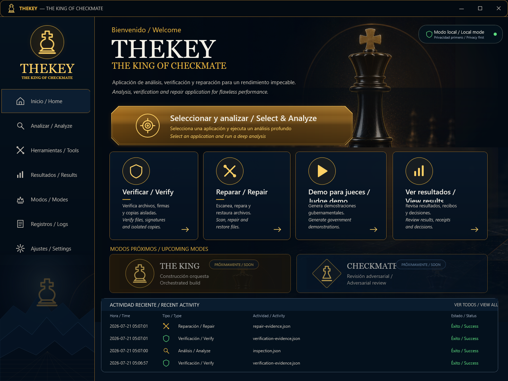

# THEKEY
## THE KING OF CHECKMATE

**Governed Codex Transactions for Coding Agents**

Nombre público oficial: **THEKEY — THE KING OF CHECKMATE**.

> Cada cambio agéntico recibe una identidad de plan, autorización explícita,
> gates deterministas y evidencia revisable.

[English](README.en.md) · [Guía rápida](docs/build-week/JUDGE_QUICKSTART.es.md) ·
[Contribución Build Week](BUILD_WEEK_CONTRIBUTION.es.md) ·
[Delta Build Week](docs/build-week/BUILD_WEEK_DELTA.md) ·
[Seguridad](SECURITY.md) · [Licencia MIT](LICENSE)

Versión actual: `0.2.0`.

## El problema

Los agentes pueden cambiar un repositorio con rapidez, pero un equipo todavía
puede ser incapaz de demostrar qué plan fue aprobado, quién autorizó la
ejecución física, qué se ejecutó y por qué el resultado quedó habilitado para
release. THEKEY incorpora esas preguntas a la transacción.

## Qué es — y qué no es

La jerarquía pública canónica distingue cuatro responsabilidades:

- **THEKEY:** producto y núcleo de transacciones gobernadas.
- **THE KING:** orquestador de fases y contexto; no puede autoaprobarse ni
  eludir el `PolicyEngine`.
- **CHECKMATE:** revisión adversarial previa a la ejecución; analiza riesgos y
  emite un veredicto, pero no realiza escrituras físicas.
- **Codex with GPT-5.6:** agente utilizado para analizar, construir, probar y
  mejorar el proyecto; no es una dependencia runtime.

THEKEY es una capa pequeña de gobierno en Python. Liga plan, revisión CHECKMATE
previa, autoridad humana explícita, política determinista, handlers físicos,
cuatro gates y evidencia persistida a un único run y una transacción.

Proporciona aislamiento de flujo de trabajo, autorización de política
determinista, diagnóstico ejecutable y dispatch fail-closed. No es un sandbox
de sistema operativo, una firma humana criptográfica ni un servicio de
atestación externo. Su reparación automática es deliberadamente acotada:
prueba mutaciones conservadoras de un solo punto sobre Python y solo acepta una
si compila y pasa la suite completa y todos los gates.

## Aplicación portable en dos clics

`THEKEY-Portable-Windows-x64.zip` está dirigido a Windows 10 x64 y Windows 11
x64. Tras extraerlo, abre `THEKEY.exe`, pulsa **Seleccionar y analizar / Select
& Analyze** y elige un proyecto Python. La primera fase solo lee el proyecto:
detecta su perfil, tests y metadatos; CHECKMATE revisa el riesgo y el
`PolicyEngine` decide si puede continuar. **Verificar / Verify** exige
consentimiento explícito, copia únicamente los archivos inspeccionados a un
workspace corto y aislado, y ejecuta allí los checks y tests del adaptador,
un escaneo limitado de secretos y el gate documental. Finalmente vuelve a hashear el
origen y demuestra si permaneció intacto.

**Reparar / Repair** convierte los fallos de compilación y pytest en
diagnósticos legibles, busca una reparación dentro de un conjunto cerrado de
mutaciones, vuelve a ejecutar todos los gates y solicita consentimiento para
aplicar exactamente los bytes verificados. Antes de escribir comprueba que la
fuente y los tests no hayan cambiado, conserva un backup fuera del proyecto y
hace rollback si la verificación posterior falla. Dependencias ausentes,
fallos sin tests, secretos o documentación incompleta se bloquean en vez de
improvisarse.

La copia de trabajo evita `bin`, `obj`, `publish`, entornos virtuales y otros
artefactos generados. Los tests seleccionados son código local de confianza:
se ejecutan en una copia, pero no en un sandbox del sistema operativo. La
tarjeta secundaria **Demo para jueces** conserva el recorrido reproducible de
Build Week. El paquete incluye el runtime y no exige Python, Git ni PowerShell
7 en el equipo del juez.

El ZIP incluye `SAMPLE-PYTHON-APP` para el recorrido saludable y
`SAMPLE-REPAIRABLE-PYTHON-APP` para observar una detección, reparación,
aplicación y reverificación reales sin preparar otro repositorio.

La pantalla de inicio es UI WPF real: controles, texto, foco de teclado y
vectores se renderizan de forma nativa. La imagen de referencia nunca se carga
como fondo de interfaz. Consulta el [contrato visual](docs/THEKEY_VISUAL_CONTRACT.md),
el [mapa funcional](docs/BUILD_WEEK_FUNCTION_MAP.md), el
[guion de tres minutos](docs/DEMO_SCRIPT_3_MINUTES.md) y la
[comparación visual reproducible](scripts/compare-build-week-visual.py).



La comparación final a 1448 × 1086 registra **94,336 %** de similitud global,
**93,906 %** con peso equivalente por regiones y **92,222 %** de similitud de
bordes. La [captura](artifacts/build-week/visual/iteration-12/actual.png), el
[diff](artifacts/build-week/visual/iteration-12/diff.png) y el
[informe](artifacts/build-week/visual/iteration-12/report.json) corresponden al
mismo árbol visual WPF nativo; no se declara identidad matemática.

El manifest del paquete hashea todos los archivos distribuidos y registra el
commit base más si el build procede de un árbol limpio. Un build limpio marca
`source_commit_exact=true`; uno local con cambios lo declara
`source_tree_state=DIRTY_BUILD` en vez de fingir trazabilidad exacta. Consulta
la [guía portable](docs/build-week/PORTABLE_WINDOWS.md).

## Judge Mode desde el código fuente

Plataforma de instalación fuente verificada: Windows 11, PowerShell 7, Python
3.11 o superior y Git.

```powershell
git clone https://github.com/klssxx/THEKEY.git
cd THEKEY
python -m venv .venv
.\.venv\Scripts\python.exe -m pip install --upgrade pip
.\.venv\Scripts\python.exe -m pip install -e .
pwsh -NoProfile -File .\scripts\build-week-demo.ps1
pwsh -NoProfile -File .\scripts\verify-build-week-evidence.ps1
```

No requiere API key, servicios de pago, Docker, WSL, GPU, dependencias privadas
ni cuenta de prueba. Judge Mode crea un Git temporal bajo el directorio
ignorado `.thekey`, repara un defecto controlado solo en el runtime aislado,
ejecuta el flujo real y mantiene sin cambios el repositorio fuente.

Resumen esperado:

```text
THEKEY BUILD WEEK JUDGE MODE
ALLOW: APPLIED, handlers=1
DENY: ROLE_NOT_ALLOWED, handlers=0
GATES: 4/4 PASS
DECISION: RELEASE_ELIGIBLE
SOURCE: unchanged=True
RECEIPTS: bound=True
PRODUCTION REUSE: False
```

El verificador analiza el JSON y los recibos persistidos; no acepta el texto
impreso como prueba. Comprueba ALLOW de un handler, DENY de cero, hashes sin
cambios, cuatro gates, recibos ligados, `production_reuse=false` y la decisión
persistida. Consulta la [guía rápida](docs/build-week/JUDGE_QUICKSTART.es.md).

## Flujo de transacción

```text
Plan de misión
  → recibo CHECKMATE previo
  → recibo de autoridad soberana acotada
  → decisión del PolicyEngine
  → guard de dispatch físico
  → un handler declarado
  → gates de build, tests, secretos y documentación
  → decisión de release y evidencia revisable
```

El guard valida un `ActionContext` Pydantic estricto antes de buscar el handler.
Los dos recibos deben coincidir en run ID, transaction ID y SHA-256 del plan.
También deben concordar autorización, versión y hash de política, rol, verdict
y scope. Solo `Role.EXECUTOR` cruza la frontera. Campos ausentes o extra,
mismatches, roles distintos, `PENDING`, `DEFER`, `FAIL`, excepciones o una
decisión incompleta fallan de forma cerrada.

`ActionReviewVerdict` ocurre antes de ejecutar. `ReleaseDecision` nace después
de los gates y nunca se reutiliza retroactivamente como autoridad.

## Arquitectura

- **THE KING (orquestador):** coordina fases y contexto, persiste y rehidrata
  la transacción, sin autoaprobarse ni eludir el `PolicyEngine`.
- **Revisor CHECKMATE:** analiza riesgos y emite el recibo previo del plan
  acotado; no realiza escrituras físicas.
- **Binder soberano:** liga el grant visible de usuario a una fuente, run,
  transacción y salida aislada.
- **PolicyEngine:** devuelve permiso, razón, decision ID y hash de policy bundle.
- **Guard físico:** autoriza antes del lookup; no expone shell o rutas arbitrarias.
- **Workspace manager:** limita los cambios al workspace del workflow.
- **Verifier:** ejecuta build, tests, escaneo limitado y documentación.
- **Evidencia/estado:** hashea artefactos, registra transiciones y valida estado.

## Otros comandos

```powershell
# Regresión completa
.\.venv\Scripts\python.exe -m pytest -q

# Demo canónica
.\.venv\Scripts\python.exe -m thekey demo

# Diagnosticar en una copia aislada (no modifica el origen)
.\.venv\Scripts\python.exe -m thekey project verify `
  --source C:\ruta\app --consent execute_trusted_tests

# Buscar una reparación verificada sin aplicarla
.\.venv\Scripts\python.exe -m thekey project repair `
  --source C:\ruta\app --consent execute_trusted_tests

# Aplicar únicamente la reparación que superó todos los gates
.\.venv\Scripts\python.exe -m thekey project repair `
  --source C:\ruta\app --consent execute_trusted_tests `
  --apply-consent apply_verified_repairs

# Equivalente tras activar el entorno
python -m thekey demo

# Ciclo reanudable entre procesos
.\.venv\Scripts\python.exe -m thekey run create --title "Fix calculator.add"
.\.venv\Scripts\python.exe -m thekey run plan --run-id <RUN_ID>
.\.venv\Scripts\python.exe -m thekey run approve-plan --run-id <RUN_ID>
.\.venv\Scripts\python.exe -m thekey run execute --run-id <RUN_ID>
.\.venv\Scripts\python.exe -m thekey run verify --run-id <RUN_ID>
.\.venv\Scripts\python.exe -m thekey evidence verify --run-id <RUN_ID>
```

## Contribución Build Week y colaboración con Codex

THEKEY se declara explícitamente como proyecto preexistente. El grafo Git
público disponible desde `origin/main` comienza después del corte; por ello la
declaración histórica del propietario es `CLAIM_RECORDED` y los registros aún
no importados son `PENDING_EVIDENCE_IMPORT`, nunca prueba precorte verificada.
El baseline ya contenía lifecycle gobernado, workspaces, policy y gates,
evidencia, CLI y demo.

Solo se presenta para evaluación la extensión verificable posterior al
baseline. Consulta [BUILD_WEEK_CONTRIBUTION.es.md](BUILD_WEEK_CONTRIBUTION.es.md),
el [delta](docs/build-week/BUILD_WEEK_DELTA.md) y la
[declaración de procedencia](docs/build-week/PRE_PUBLIC_PROVENANCE.md).

En el hilo principal, Codex con GPT-5.6 se usó para inspección, diseño e
implementación de recibos estrictos y guard fail-closed, migración de los cinco
callers, tests adversariales, endurecimiento del grant no reutilizable,
RED→GREEN, regresión, rollback, clon limpio y material de jueces. GPT-5.6 fue
herramienta de desarrollo y no es una dependencia runtime.

El usuario retuvo las decisiones de producto y autoridad: soberanía humana, scope
acotado, reutilización productiva prohibida, `LIVE_E` intacto y permisos
separados para push, merge, release, vídeo y Devpost.

- Session ID `/feedback` verificado:
  `019f79f2-6a7e-74f0-b1fa-d65335b29a7c`
- Los metadatos locales registran `gpt-5.6-luna` y `gpt-5.6-sol` durante el hilo.
- Registro público saneado:
  [CODEX_SESSION_EVIDENCE.md](docs/build-week/CODEX_SESSION_EVIDENCE.md)

## Límites de seguridad

- Judge Mode está verificado en Windows 11; no se afirman otras plataformas.
- El aislamiento de workflow no es aislamiento de proceso ni de SO.
- El grant local exige `JUDGE_MODE_DEMO_ONLY`, hash normalizado canónico y
  `ISOLATED_RUN_WORKSPACE_ONLY`; no es una firma humana criptográfica.
- SHA-256 aporta evidencia tamper-evident dentro del sistema, no invulnerable ni
  atestada externamente.
- El escaneo de secretos es limitado.
- La reparación de aplicaciones cubre Python con tests pytest detectables y
  mutaciones conservadoras de un punto; no instala dependencias ni promete
  resolver automáticamente cualquier defecto.
- Judge Mode sigue siendo un escenario separado de acción declarada y grant no
  reutilizable en producción.
- Rutas Windows muy profundas pueden superar el límite; usa un clon corto.
- El manifiesto Phase-B conserva el flag legado
  `CANONICAL_SOURCE_STATUS=PROVENANCE_UNRESOLVED`; el dossier usa
  `CLAIM_RECORDED` y `PENDING_EVIDENCE_IMPORT` para la historia prepública.
  `FULL_CHECKMATE=false` y `MACRO_PACK_2=NOT_STARTED`.

Consulta [THREAT_MODEL.md](THREAT_MODEL.md), [SECURITY.md](SECURITY.md) y la
[auditoría adversarial final](docs/build-week/CHECKMATE_FINAL_AUDIT.md).

## Licencia

THEKEY usa la [Licencia MIT](LICENSE). Se comprobaron las licencias de las
dependencias directas; no se afirma una auditoría transitiva completa.
